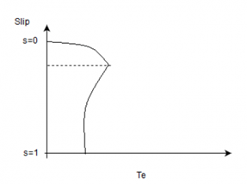
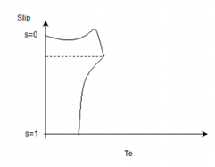

## Post test
#### Please attempt the following questions

Q1. The shape of torque/slip curve of an induction motor is:

A. Hyperbola
B. Ellipse
C. Straight line
D. Rectangular parabola 

Q2. Introducing the external resistance increases____.
  &nbsp; &nbsp;&nbsp; &nbsp;i. Speed
  &nbsp; &nbsp;&nbsp; &nbsp;ii. Output power
  &nbsp; &nbsp;&nbsp; &nbsp;iii. Starting torque

A. iii
B. ii,iii
C. ii
D. i, ii, iii

Q3. Introducing the external resistance decreases____.
&nbsp; &nbsp;&nbsp; &nbsp;i. Speed
&nbsp; &nbsp;&nbsp; &nbsp;ii. Output power
&nbsp; &nbsp;&nbsp; &nbsp;iii. Starting torque

A. iii
B. ii
C. i,ii
D. i, ii, iii

Q4. Slip v/s torque developed in an induction motor is?

A.

B.

C.

D.

Q5. When a three phase induction motor is rotating at steady state. Then if the load is increased then the slip will _____ and the efficiency will __________ .

A. Decrease, increase
B. Decrease, decrease
C. Increase, increase
D. Increase, decrease

Q6. In a 3-phase IM, maximum torque of 300Nm occur at slip of 10%. The torque at slip of 5% would be____ .

A. 120Nm
B. 240Nm
C. 150Nm
D. 300Nm

Q7. For standard 3-phase IM, the rotating direction of motion is-

A. Opposite to that of the rotating field
B. Same as that of the rotating field
C. Depends in supply voltage phase sequence
D. Depends in supply voltage phases

Q8. If Ns is the synchronous speed and S the slip, then the actual running speed of a three- phase induction motor will be-

A. N~S~
B. SN~S~
C. (1-S)N~S~
D. (N~S~-1)S

Q9. A 3-phase 440v, 50Hz induction motor has 4% slip. The frequency of rotor e.m.f. will be-

A. 200Hz
B. 50Hz
C. 2Hz
D. 0.2Hz

Q10. A 6 pole, 50 Hz, 3-phase induction motor is running at 950 rpm. It has rotor copper loss of 5 KW. The rotor input will be -

A. 100 KW
B. 95 KW
C. 10 KW
D. 5.3 KW

